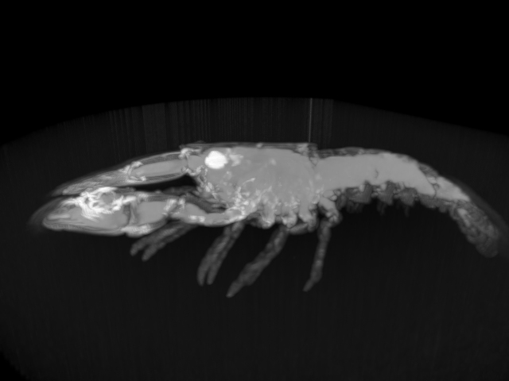

# VolumeRCInline

This is a volume ray-caster based on [VkInline](https://github.com/fynv/vkinline), and written fully in Python.

Install VkInline:
```
$ pip3 install VkInline
```

Install Pillow (needed by the test):
```
$ pip3 install pillow
```

Clone the code then run the test:
```
$ python3 test_lobster.py
```

